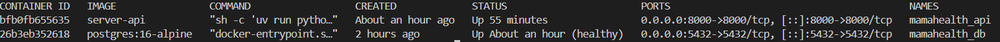
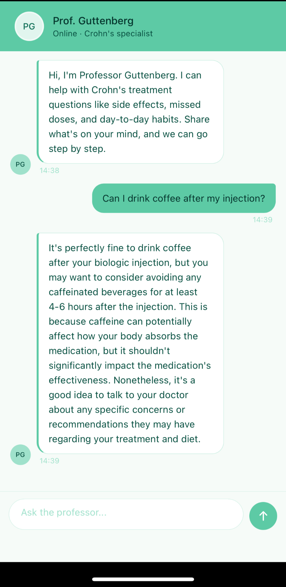
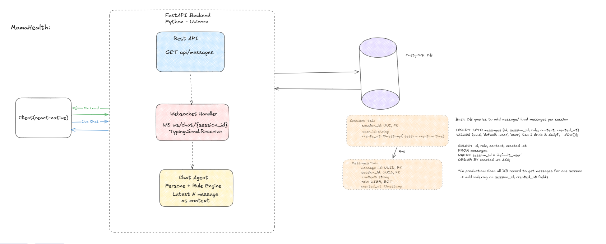

# MamaHealth

## Table of contents

1. [How to run](#how-to-run)
2. [Tech stack](#tech-stack)
3. [Design diagram](#design-diagram)
4. [Project architecture](#project-architecture)
5. [Design decisions](#design-decisions)
6. [API endpoints](#api-endpoints)
7. [Troubleshooting](#troubleshooting)
8. [Production considerations](#production-considerations)
9. [Support](#support)

---

## How to run

### Prerequisites

- Docker & Docker Compose
- Node.js 18+
- npm 9+

### Setup

1. Copy environment files:

```bash
cp client/.env.example client/.env
cp server/.env.example server/.env
```

2. Get your IP address:

```bash
ipconfig
```

Copy the IPv4 Address (e.g., `192.168.1.x`) and update `client/.env` with your IP.

3. Add your Groq API key in `server/.env`:

```
GROQ_API_KEY=your_api_key_here
```

> **Note:** Copy the key from the shared 1Password link. If the quota has ended or link does not work, see the [Groq API key guide](#groq-api-key-guide).

### Frontend

```bash
cd client && npm install && npx expo start
```

### Backend

```bash
docker compose up --build
```

#### Verify containers are running

```bash
docker ps
```

This is what you should see:


#### Open Expo Go

This is what you should see:


---

## Tech stack

| Layer | Technology |
|-------|-------------|
| Frontend | Expo (React Native) |
| Backend | FastAPI (Python) |
| Database | PostgreSQL |
| AI | Groq (Llama 3.1) |

---

## Design diagram



---

## Project architecture

- `/client` - Expo frontend
- `/server` - FastAPI backend
  - `chat/` - Chat service with interface + implementation
  - `config/` - Dependencies and database configuration
  - `message/` - Message repository (interface + implementation)
  - `session/` - Session repository (interface + implementation)
  - `test/` - Unit tests

---

## Design decisions

### Separation of concerns

The backend follows a layered architecture with clear separation between:

- **Routes** - Handle HTTP requests and responses
- **Services** - Contain business logic
- **Models** - Define database schemas

### Abstract layer

The application uses an abstract service layer to decouple business logic from specific implementations. This allows:
- Easy swapping of implementations (e.g., different LLM providers)
- Unit testing without dependencies
- Clear contracts between layers

---

## API endpoints

- `GET /health` - Health check
- `POST /api/sessions` - Create session
- `GET /api/sessions/{session_id}` - Get session
- `GET /api/messages?session_id=<uuid>` - Get messages
- `WS /ws/chat/{session_id}` - WebSocket chat

---

## Groq API key guide

If your Groq quota has ended, you can create a new API key:

1. Go to [console.groq.com](https://console.groq.com/)
2. Sign in or create an account
3. Click **API Keys** in the sidebarand Click **Create API Key**
4. Copy the key and update `server/.env`

---

## Troubleshooting

### Docker

| Error | Fix |
|-------|-----|
| `connection refused` | Ensure Docker is running |
| `port already in use` | Stop other services on port 8000, or change port in docker-compose.yml |

### Backend

| Error | Fix |
|-------|-----|
| `GROQ_API_KEY` missing | Add to server/.env |
| `relation does not exist` | Run `docker compose down -v` to reset database |

### Frontend

| Error | Fix |
|-------|-----|
| Metro bundler error | Run `npx expo start --clear` |
| Device not found | Ensure device is on same network as host |

---

## Production considerations

### Security

In production, secure the WebSocket connection with token-based authentication:

1. **Authenticate on connect** - Pass JWT in query string or headers
2. **Validate token** - Verify signature and expiration before accepting connection
3. **Rate limiting** - Prevent spam/abuse with per-user limits
6. **Input validation** - Validate and sanitize message content server-side before passing to the LLM

### AI Agent Enhancement

- Embed treatment documents and use semantic search for better context
- Add evaluation agent for answer validation
- Implement prompt injection detection

---

## Support

For support issues, contact: wassim@lifecare.co